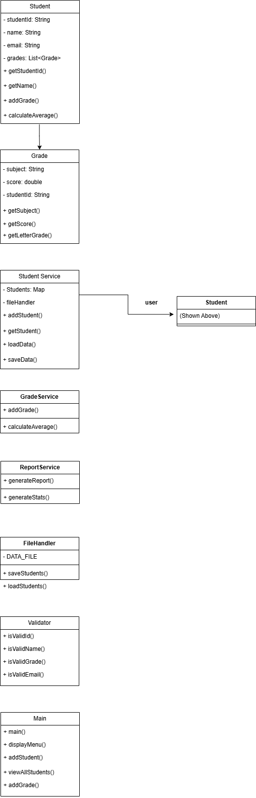
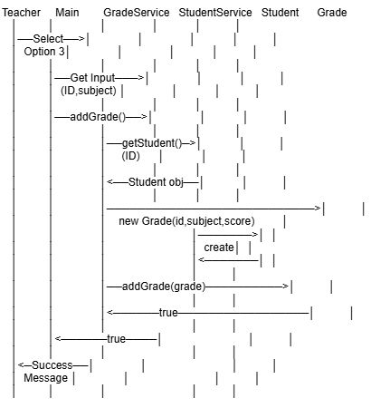
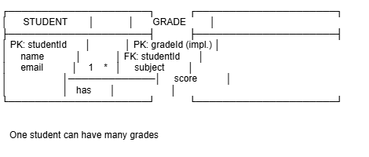
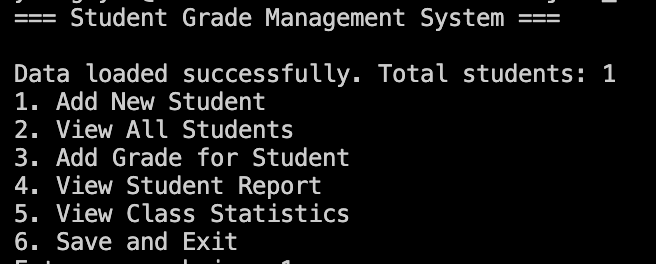
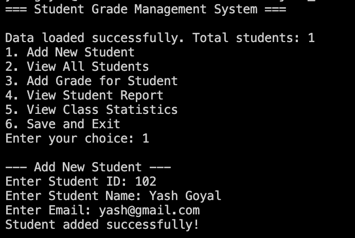
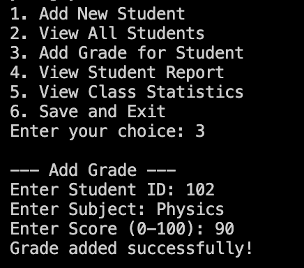
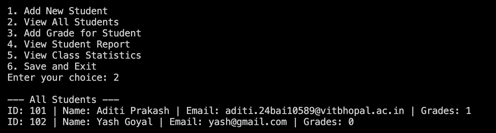
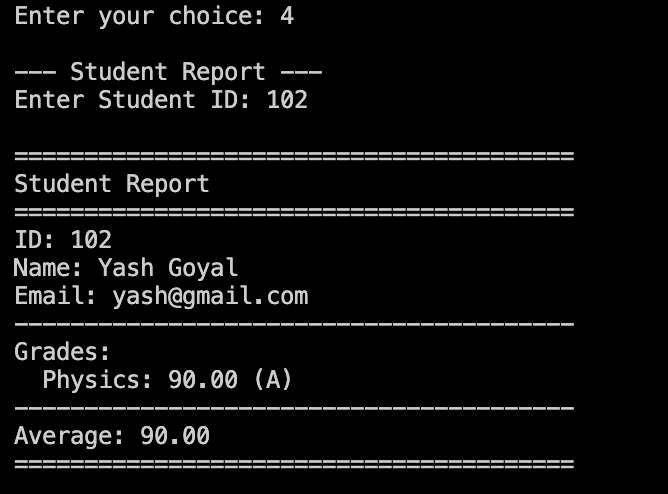
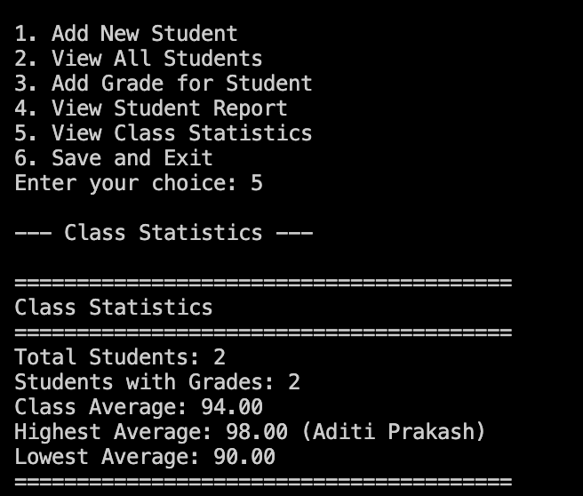

<div align="center">

<br/>

# STUDENT GRADE MANAGEMENT SYSTEM

### — Console-Based Java Application —

<br/>

[](https://www.java.com)
[](https://github.com/AzhaanGlitch/VITyarthi-Project)
[](LICENSE)
[]()
[]()

<br/>

```
  Manage Students  ·  Record Grades  ·  Generate Reports  ·  Persist Data
```

<br/>

</div>

---

## About the Project

The **Student Grade Management System** is a lightweight, menu-driven Java application that handles the full lifecycle of student academic data. From registration to report generation, it offers a structured and reliable workflow for managing student records — with no database or framework dependency, powered entirely by core Java and file-based persistence.

---

## Table of Contents

- [Features](#features)
- [Project Structure](#project-structure)
- [Technologies](#technologies)
- [Getting Started](#getting-started)
- [Usage](#usage)
- [System Diagrams](#system-diagrams)
- [Screenshots](#screenshots)
- [Non-Functional Requirements](#non-functional-requirements)
- [Testing](#testing)
- [Author](#author)

---

## Features

**Student Management**
Register new students, browse existing records, and search by name or ID.

**Grade Recording**
Attach subject-specific grades to any registered student with full validation.

**Report Generation**
Produce per-student academic summaries and class-wide performance statistics.

**Data Persistence**
All records are saved to and loaded from local text files — data survives across sessions.

**Input Validation**
The system rejects malformed input, including empty fields, out-of-range grades, and duplicate entries.

---

## Project Structure

```
JAVA_PROJECT_YASH/
│
├── src/
│   ├── models/
│   │   ├── Student.java
│   │   └── Grade.java
│   ├── services/
│   │   ├── StudentService.java
│   │   ├── GradeService.java
│   │   └── ReportService.java
│   ├── utils/
│   │   ├── FileHandler.java
│   │   └── Validator.java
│   └── Main.java
│
├── data/
│   └── students.txt
│
├── docs/
│   ├── diagrams/
│   │   ├── 01-use-case-diagram.png
│   │   ├── 02-class-diagram.png
│   │   ├── 03-sequence-diagram.png
│   │   ├── 04-architecture-diagram.png
│   │   ├── 05-er-diagram.png
│   │   └── 06-process-flow-diagram.png
│   └── screenshots/
│       ├── main_menu.png
│       ├── add_data.png
│       ├── add_grade.png
│       ├── view_data.png
│       ├── stu_report.png
│       └── class_report.png
│
├── .gitignore
├── HowToRun.txt
├── ProjectReport.pdf
├── settings.json
├── statement.md
└── README.md
```

---

## Technologies

| Component | Detail |
|-----------|--------|
| Language | Java 11+ |
| Paradigm | Object-Oriented Programming |
| Storage | File I/O via `java.io` / `java.nio` |
| Collections | `ArrayList`, `HashMap` |
| Build | `javac` — no Maven/Gradle required |

---

## Getting Started

### Prerequisites

- JDK 11 or above installed
- Git

### Clone & Compile

```bash
# Clone the repository
git clone https://github.com/AzhaanGlitch/VITyarthi-Project.git
cd JAVA_PROJECT_YASH

# Compile all source files
javac -d bin src/models/*.java src/services/*.java src/utils/*.java src/Main.java

# Run the application
java -cp bin Main
```

> See [`HowToRun.txt`](HowToRun.txt) for platform-specific notes.

---

## Usage

On launch, the system displays a numbered menu:

```
+--------------------------------------+
|  STUDENT GRADE MANAGEMENT SYSTEM     |
+--------------------------------------+
|  [1]  Add New Student                |
|  [2]  Add Data / Enroll Subject      |
|  [3]  Add Grade for a Student        |
|  [4]  View All Students              |
|  [5]  View Student Report            |
|  [6]  View Class Report              |
|  [7]  Exit                           |
+--------------------------------------+
```

Select an option by entering its number and follow the prompts. All changes are saved automatically on exit.

---

## System Diagrams

### Architecture Diagram
Overview of the application's layered design.


---

### Use Case Diagram
Captures all user interactions with the system.


---

### Class Diagram
Shows class relationships, attributes, and methods.



---

### Sequence Diagram
Illustrates the message flow for core operations.



---

### ER Diagram
Entity-relationship model for the stored data structures.



---

### Process Flow Diagram
Complete flow from application start to data persistence.


---

## Screenshots

### Main Menu



---

### Add Data



---

### Add Grade



---

### View Data



---

### Student Report



---

### Class Report



---

## Non-Functional Requirements

| Property | Target |
|----------|--------|
| Performance | All operations complete within 1 second |
| Usability | Numbered menu requires no prior training |
| Reliability | File-backed persistence survives application restarts |
| Maintainability | Separated models, services, and utilities layers |
| Robustness | Graceful handling of all invalid inputs |

---

## Testing

All testing is performed manually via the console. Coverage includes:

- Registering students with valid and invalid inputs
- Recording grades — including boundary values (0 and 100) and negatives
- Verifying that report calculations match expected averages
- Confirming data is correctly written and reloaded from file

---

## Author

**Yash** — *JAVA_PROJECT_YASH*

[](https://github.com/AzhaanGlitch/VITyarthi-Project)

---

<div align="center">
<br/>
<sub>Built with Java · Driven by OOP · Persistent by design</sub>
<br/><br/>
</div>
